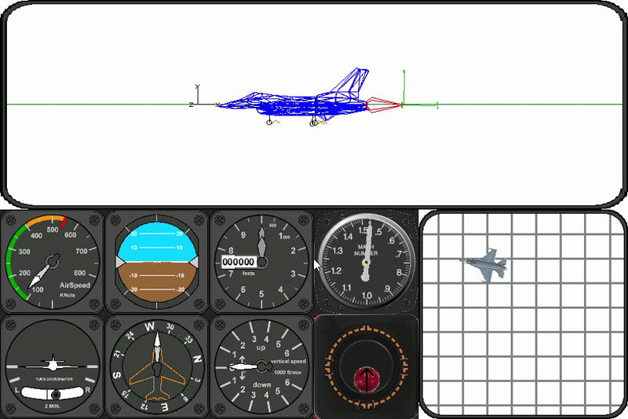

# Airplane Simulation
Simple aero model of the Navion airplane solved with home brew six degree of freedom (6-DOF) solver.
Everything is written in pure Python. Minor dependance on Pygame.

## Theory of operation
In the future.

## Why?
1. To be an interactive tool and support tutorials.
2. To interact with the controller during development (Software In The Loop). This eliminates the needs for any hardware during early stages of controller develop.

## What does it simulate / demonstrate
- Linear aerodinamics with secondary effects.
- Movement in 3D space.

### Take off in real-time and 3D wireframe graphics.

## Future plans
- Demonstrate closed-loop controlers.

Requires Python to run the example code (inclues dedicated unit-test). For visual support install pyGame and GSOF_3dWireFrame.

http://python.org/

http://www.pygame.org

https://github.com/mrGSOF/3dWireFrame

or

https://github.com/mrGSOF/GSOF_3dWireFrame

## Running instructions
- Install requirements `pip install -r requirements.txt`
- Clone and install GSOF_3dWireFrame (`pip install .` or `setup.bat`)
- Clone roboticArmSim
- run `python Simulation.py`

Interactive operation is supported using the mouse and keyboard.
